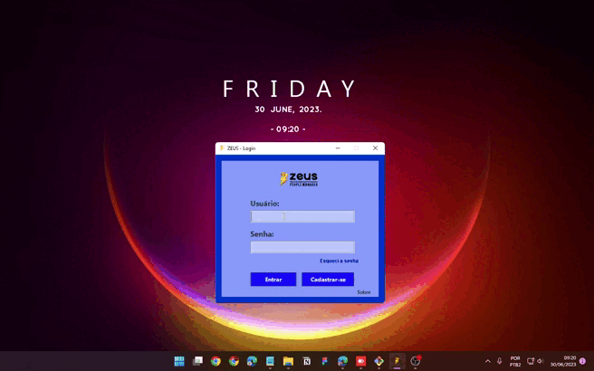
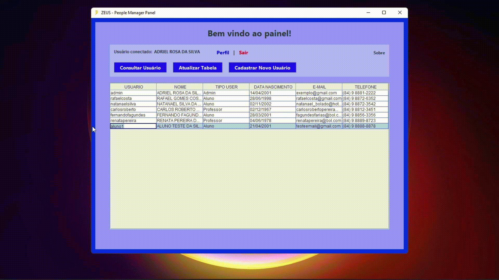

# Zeus People Manager
CRUD Simples em JAVA Swing - Atividade avaliatia final de Programação de Soluções computacionais.

> Adriel Rosa (update 01/07/2023  16:38 PM)

Software desenvolvido em Java Swing com o objetivo de cadastro de usuarios (Administradores, Alunos e Professores).
## Funcionalidades: 

### Cadastro:

- Realiza o cadastro de novos usuarios, sendo eles: Administrador, Aluno, e Professor. Cada usuario tem um nivel de acesso diferente ao sistema, falicitando a manipulação de dados como remoção e e deição de usuarios cadastrados apenas por Administradores, visualização de dados completos não sensiveis e pouco sensiveis por Admins e Professores, e apenas a visualização de dados não sensiveis aos Alunos.

- Na realização de cadastro, foram implementadas funcionalidades que verifica se o usuario digitado está disponivel para cadastro, que valida se o CPF informado é valido ou não, que valida se o E-mail informado está disponivel, se a data de nascimento é valida, e sé o usuario tem entre 0 e 120 anos.

##

### Login:

 

- Realiza o login na plataforma "Zeus people manager" dando acesso ao painel de usuarios cadastrados.

##

###  Perfil:

- Exibe todas as informações do usuario logado atualmente na plataforma.

##

###  Pesquisa de usuários:

- Permite buscar um usuario cadstrado no sistema atravez dos seguintes imputs:
   - Usuario
   - CPF
   - E-mail
   - Nome

 ##

###  Redefinição de senha de usuários:

- Permite redefinir senha de usuario atravez da resposta de uma pergunta de segurança definida no cadastro do usuario.

 ##
 - OBS: Foi realizado um Backup do banco que está incluso com os arquivos.

 ## Tecnologias:
 - Java
 - Java Swing
 - MySQL
 - MySQL Workbench
 - Git & GitHub
 
 ## Contato:
 
 - E-mail: adrielrosa@live.com 
 - Linkedin: https://www.linkedin.com/in/adriel-rosa-660431144/
